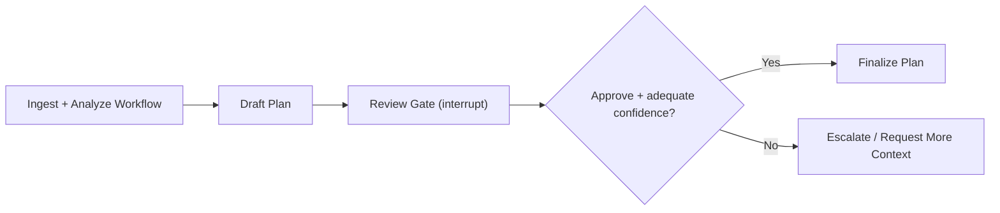

# Agent Deployment Readiness Lab

A focused LangGraph application that turns a messy business workflow request into a structured agent deployment plan.

This project is intentionally narrow. It is not a chatbot, a general-purpose multi-agent platform, or a claim of "production-ready enterprise AI." It is a small applied LangGraph repo designed to show the pieces LangChain's ecosystem keeps emphasizing in public:

- stateful orchestration
- human-in-the-loop approval
- confidence-aware escalation
- clear runtime outputs
- observability and evaluation hooks

It supports two operating modes:

- **Live model mode** for real LangChain/LangGraph runs
- **Offline demo mode** for walking through the graph without API keys

## What It Does

Given a workflow brief such as:

> "We need an AI workflow to help our ops team handle client onboarding emails, summarize requirements, flag missing info, and create a handoff plan."

the graph produces:

- a normalized workflow summary
- an analysis of risks, review points, and capabilities
- a proposed agent design
- a rollout checklist
- a human approval interrupt before final output
- an escalation path when confidence is low

## Why This Use Case

This repo is designed around deployment judgment rather than demo polish. The goal is to show how an agent workflow can be made legible, reviewable, and safer to roll out in a real business environment.

## Architecture



### State

The graph keeps track of:

- the original brief
- a structured brief
- workflow analysis
- the draft plan
- confidence
- reviewer decision and notes
- the final output

## Project Layout

```text
agent-deployment-readiness-lab/
  README.md
  pyproject.toml
  .env.example
  langgraph.json
  docs/
  examples/
  src/
  tests/
```

## Quickstart

### 1. Install dependencies

```bash
uv venv
source .venv/bin/activate
uv sync
```

### 2. Configure environment

```bash
cp .env.example .env
```

Set your model and LangSmith keys in `.env`.

If you want to run the project without model keys first, set:

```bash
AGENT_DEPLOYMENT_DEMO_MODE=true
```

For GPT-5 models, you can also tune reasoning effort:

```bash
AGENT_DEPLOYMENT_REASONING_EFFORT=low
```

That is useful when the workflow is structured and operational, but does not need deep multi-minute reasoning.

### 3. Run locally with LangGraph Studio

```bash
uvx --refresh --from "langgraph-cli[inmem]" --with-editable . --python 3.11 langgraph dev
```

This should expose:

- local API
- Studio UI
- local docs

### 4. Run a terminal demo

```bash
source .venv/bin/activate
python run_demo.py \
  --brief-file examples/sample_briefs/onboarding_ops.txt \
  --auto-approve \
  --show-interrupt \
  --output-file outputs/onboarding_plan.md
```

This gives you a fast, reproducible demo path without needing to drive everything through Studio.

Why `python run_demo.py` instead of the installed console script?

- it is the most reliable path during local development
- it avoids editable-install quirks in workspaces with spaces in the folder name
- the underlying CLI logic is the same

If `.env` contains `AGENT_DEPLOYMENT_DEMO_MODE=true`, the graph will use deterministic demo outputs instead of live model calls. That is useful for validating the workflow mechanics before switching to real LLM runs.

### 5. Try a sample brief in Studio

Use one of the files in [`examples/sample_briefs`](./examples/sample_briefs) as your initial input.

Suggested input payload:

```json
{
  "brief": "We need an AI workflow to help our ops team handle client onboarding emails, summarize requirements, flag missing info, and create a handoff plan."
}
```

When the graph hits the approval step, resume it with something like:

```json
{
  "approved": true,
  "notes": "Looks good. Keep the rollout conservative."
}
```

If you want the graph to stop at review without auto-approving, run:

```bash
python run_demo.py --brief-file examples/sample_briefs/onboarding_ops.txt --show-interrupt
```

## LangSmith

To trace runs in LangSmith, set:

```bash
LANGSMITH_API_KEY=...
LANGSMITH_TRACING=true
LANGSMITH_PROJECT=agent-deployment-readiness-lab
```

## Evaluation

This repo includes a lightweight starter eval harness:

- [`tests/eval_cases.jsonl`](./tests/eval_cases.jsonl)
- [`tests/run_eval.py`](./tests/run_eval.py)

The eval script runs sample briefs through the graph, auto-approves the review step, and checks for the presence of key sections in the final output.

Run it with:

```bash
source .venv/bin/activate
python tests/run_eval.py
```

## Current Limitations

- Uses one model call per major reasoning stage rather than a richer tool-using agent loop
- Uses in-memory checkpointing for local development
- No web UI yet
- No authentication or persistent storage
- The eval harness is intentionally lightweight
- Offline demo mode is for workflow validation, not for judging model quality

More detail: [`docs/limitations.md`](./docs/limitations.md)

## Production Hardening Next

- move from in-memory checkpointing to a persistent checkpointer
- add authenticated reviewer identity and audit logging
- introduce richer tools and retrieval sources
- expand evals into trajectory and rubric-based checks in LangSmith
- add a simple inbox-style UI for interrupt review

## Demo Assets

- Architecture notes: [`docs/architecture.md`](./docs/architecture.md)
- Demo script: [`docs/demo-script.md`](./docs/demo-script.md)
- Sample briefs: [`examples/sample_briefs`](./examples/sample_briefs)
- Sample output: [`examples/sample_outputs/onboarding_plan.md`](./examples/sample_outputs/onboarding_plan.md)
