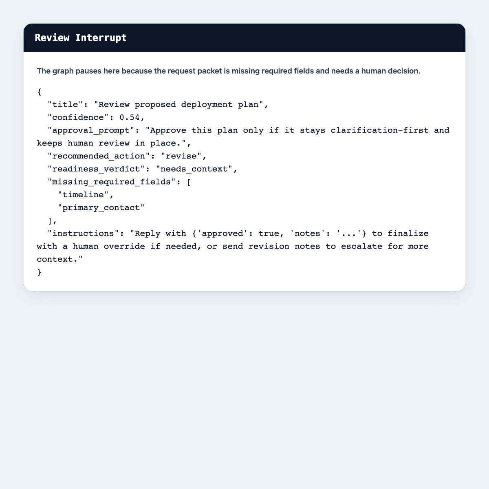
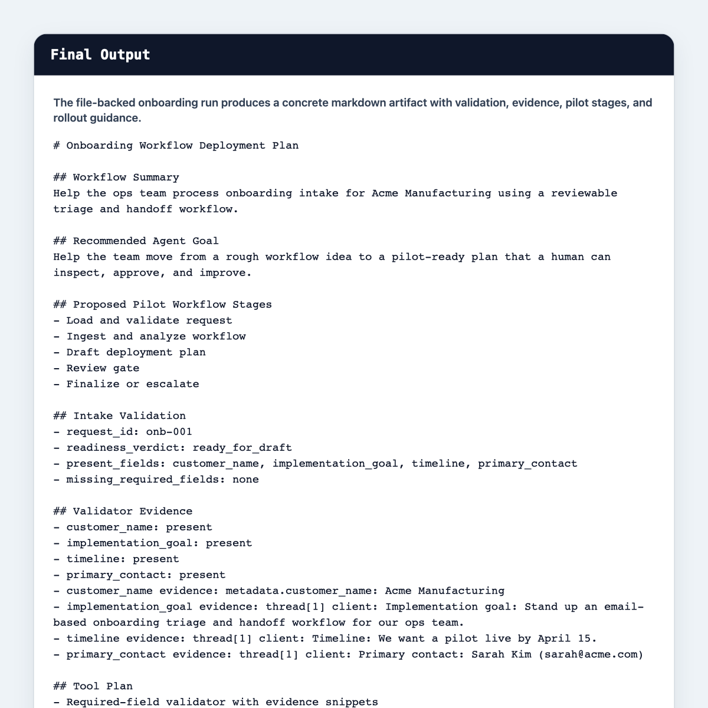

# Public Proof

This page is the public proof path for the repo.

If someone only spends a few minutes on the project, this is the shortest route to understanding that it is more than a prompt-to-markdown demo.

## What To Open First

- Request packet: [`../examples/inbox/onboarding/complete_request.json`](../examples/inbox/onboarding/complete_request.json)
- Validation schema: [`../examples/schemas/onboarding_required_fields.json`](../examples/schemas/onboarding_required_fields.json)
- File-backed sample output: [`../examples/sample_outputs/onboarding_plan.md`](../examples/sample_outputs/onboarding_plan.md)

## Review Interrupt

This is the human review checkpoint after the graph has validated the intake packet, analyzed the workflow, and drafted a pilot plan.

## Final Output

This is the resulting file-backed onboarding plan. It includes:

- deterministic intake validation
- evidence snippets for required fields
- pilot workflow stages
- human review points and guardrails

## Notes

- LangSmith traces still exist for live runs and remain useful for deeper inspection.
- The screenshots on this page are meant to be the no-friction proof path for external reviewers.
